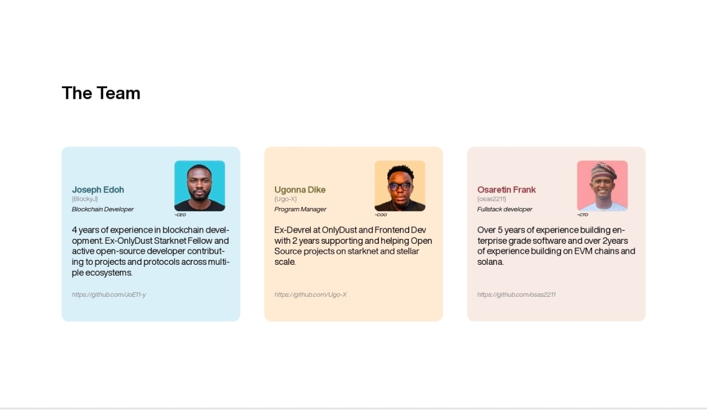
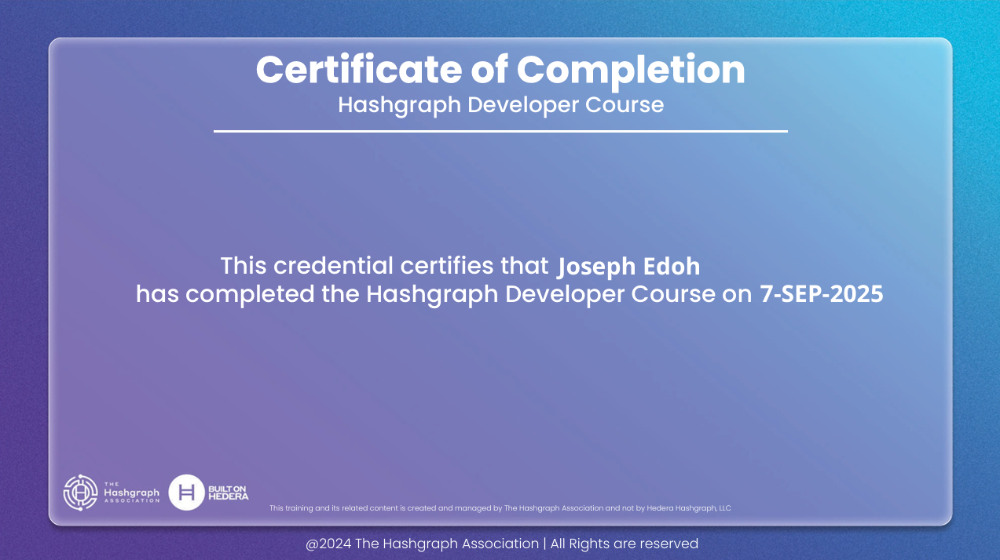
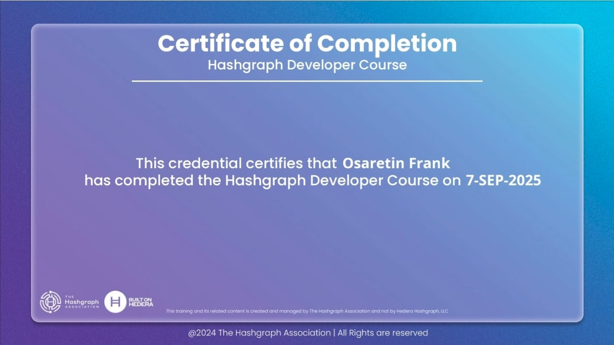

# ProofBridge

**ProofBridge** is a P2P cross-chain platform enabling direct peer-to-peer transactions and data exchange between blockchain networks. It leverages **zero-knowledge proofs (ZKPs)** and **user-driven consensus** to achieve trustless interoperability without relying on centralized relayers or custodians.

> ⚠️ **Note**: The **BLS verification library** for authentication proofs is currently under development. This component will allow ProofBridge to validate that two counterparties in a trade can act as the consensus layer, with ProofBridge serving as a neutral referee for settlement.

## 🚀 Overview

ProofBridge introduces a decentralized bridge infrastructure where **users form the consensus layer**. Instead of relying on validator committees or external relayers, counterparties themselves verify and agree on proof data.

Key primitives include:

- **Zero-Knowledge Proofs (ZKPs)**: Used to validate off-chain computation and generate proofs.
- **BLS Signatures** (in progress): Used to aggregate authentication proofs from both parties.
- **Consensus by Counterparties**: Trade participants themselves serve as lightweight validators.
- **Multi-chain Compatibility**: Designed for EVM chains and extensible to non-EVM networks.

This design enables **secure peer-to-peer asset transfers and data verification** across chains, minimizing trust assumptions and reducing the attack surface common in traditional bridge designs.

## ✨ Features

- 🔗 **Peer-to-Peer Cross-Chain Transactions** — Direct interaction between users without intermediaries.
- 🛡 **Zero-Knowledge Proof Validation** — Ensures correctness of computations and state transitions.
- 👥 **User-Driven Consensus** — Trade counterparties jointly form the verification mechanism.
- 🔑 **BLS Signature Verification (WIP)** — Aggregate proofs of agreement across participants.
- 📊 **Proof of Computation Validation** — Trustless execution of trade settlement logic.
- 🌉 **Multi-Chain Compatibility** — Supports Ethereum, EVM-compatible chains, and extensibility for non-EVM chains.
- ⚖️ **Trustless Operations** — Removes reliance on custodians, relayers, or centralized sequencers.

## 🛠 Architecture

The ProofBridge system is composed of four main layers, each working together to enable secure, peer-to-peer cross-chain transfers.

**For detailed architecture diagrams, component descriptions, and data flow, see [architecture.md](./architecture.md)**

### Contracts

- **AdManager (per chain):** Makers (liquidity providers) post and close liquidity ads on the origin chain. When a deposit is made, it is **appended as a new leaf in that chain’s Merkle Mountain Range (MMR) tree**. Each chain therefore maintains its own append-only Merkle structure, producing a verifiable root after every deposit. Assets are locked against signed **EIP-712 orders**, ensuring trade terms are cryptographically bound to a specific chain and contract.

- **OrderPortal (per chain):** Bridgers submit proofs to unlock liquidity on the destination chain. The portal validates these proofs by checking an inclusion proof against the **alternating chain’s Merkle tree root**. For example, a withdrawal on Chain B must prove that the corresponding deposit exists in Chain A’s tree. Once validated, funds are released, completing the cross-chain settlement without intermediaries.

### Proof Verifier Module

- **Merkle/Computation Validation:** Zero-knowledge proofs are used to attest that a claimed deposit exists in the Merkle tree of the opposite chain, while also enforcing trade constraints (validity of `orderHash`, amount bounds, expiry, and nullifiers). This ensures cross-chain state transitions are correct and non-replayable without exposing private data.

- **BLS Aggregation Layer (WIP):** In progress, this module will allow both Maker and Bridger to produce signatures over the same order or Merkle root. These signatures are aggregated into a single compact proof of agreement, ensuring both parties have explicitly authorized the trade before settlement.

### Relayer (Referee Node)

- **Current design:** The relayer is **stateful**, using a **pre-authorization (preauth)** model. This allows counterparties to delegate proof submission to a trusted node that maintains session state and enforces trade authorization. While this approach centralizes the relayer role, it simplifies coordination and ensures correctness while the BLS layer is still under development.

- **Future design:** Once the **BLS aggregation layer** is complete, the relayer can become **stateless and permissionless**. At that point, any honest actor can submit aggregated proofs to the destination chain’s `OrderPortal`. This change will allow multiple relayers to compete, improve liveness, and fully remove reliance on a single trusted node.

- **Planned extensions:** batching, fee markets, and cross-chain reconciliation listeners (marking ads as settled on Chain A after unlocks on Chain B).

### AI Layer

- **Maker support:** AI agents assist liquidity providers by **monitoring ads, deposits, and proofs in real time**. They can flag anomalies, recommend adjustments, or automatically trigger follow-up actions such as closing ads or rebalancing liquidity.

- **Order processing:** The AI layer helps makers **process incoming orders quickly**, reducing manual overhead. It can pre-validate order parameters, match ads with bridging demand, and optimize settlement flows.

- **Automation:** By handling routine checks and repetitive tasks, the AI layer frees up makers to focus on strategy while ensuring a faster, smoother experience for bridgers.

- **Future potential:** The AI layer will later expand to adaptive fee setting, predictive liquidity provisioning, and even operating as **co-pilot relayers** in a permissionless environment.

## 📖 Component Documentation

For detailed information about each component of the ProofBridge system, refer to the following documentation:

- **[Contracts](./apps/contracts/README.md)** - Smart contract architecture, deployed addresses with explorer links, deployment guides, and cross-chain route configuration
- **[Proof Circuits](./apps/proof_circuits/)** - Zero-knowledge proof circuits for cross-chain verification
  - [Auth Circuits](./apps/proof_circuits/auth/README.md) - Authentication proof circuits using BLS signatures
  - [Deposit Circuits](./apps/proof_circuits/deposits/README.md) - Deposit validation and Merkle proof circuits
- **[Backend Relayer](./apps/backend-relayer/README.md)** - Relayer setup, configuration, and operation instructions
- **[Frontend](./apps/frontend/README.md)** - User interface setup and development guide
- **[MMR Package](./packages/proofbridge_mmr/README.md)** - Merkle Mountain Range implementation and usage

## 📍 Roadmap

- **Phase 1 – Preauth Relayer (MVP):**

  - Stateful relayer with pre-authorization to bootstrap trust
  - On-chain MMR trees maintained per chain
  - ZK proof circuits for inclusion and trade constraint validation
  - Single relayer model to ensure stability during early testing

- **Phase 2 – BLS Aggregation:**

  - Introduce Maker + Bridger BLS signatures
  - Aggregate into compact proof of agreement
  - Reduce reliance on relayer state by shifting authentication to signatures

- **Phase 3 – AI Layer Introduction:**

  - Deploy AI-driven assistants to help makers process orders quickly
  - Agents monitor ads, deposits, and proofs in real-time
  - Automate order validation, matching, and settlement tracking
  - Improve UX and reduce operational overhead for liquidity providers

- **Phase 4 – Stateless Relayers:**

  - Transition to permissionless relayers
  - Any actor can submit proofs to the `OrderPortal`
  - Multi-relayer competition for liveness and decentralization
  - Support for batching and fee markets

- **Phase 5 – Extended Cross-Chain Support:**

  - Expand to non-EVM chains (e.g., Starknet, Solana)
  - Add monitoring, reconciliation, and safe-mode controls for anomaly handling

## 📚 Documentation

Full technical specifications and developer guides are coming soon in the [docs](./docs) directory.
Topics will include:

- Contract deployment and setup
- Proof verification flow
- Extending ProofBridge to new chains
- Local development and testing

## 🔗 Quick Links

- **Pitch Deck**: [Proof Bridge Pitch Deck](https://drive.google.com/file/d/1-293K4ucIXvWaurejT1FX6ocZJ0RmEVH/view?usp=drivesdk)
- **Demo Video**: [Proof Bridge Demo Video](https://youtu.be/DndG_KEsDds)
- **Web application**: [https://proof-bridge.vercel.app/](https://proof-bridge.vercel.app/)

## 👥 Team

- **Joseph Edoh** - Blockchain Developer,
- **Ugonna Dike** - Program manager,
- **Osaretin Frank** - Fullstack Developer.

### Team Hashgraph Certificate

### Joseph Edoh

### Osaretin Frank

## 📜 License

This project is licensed under the [MIT License](LICENSE).

## 📬 Contact

For support, feature requests, or general inquiries:

- Open an issue on [GitHub](https://github.com/Explore-Beyond-Innovations/ProofBridge)
- Join the community discussions (coming soon in Discord/Telegram)
